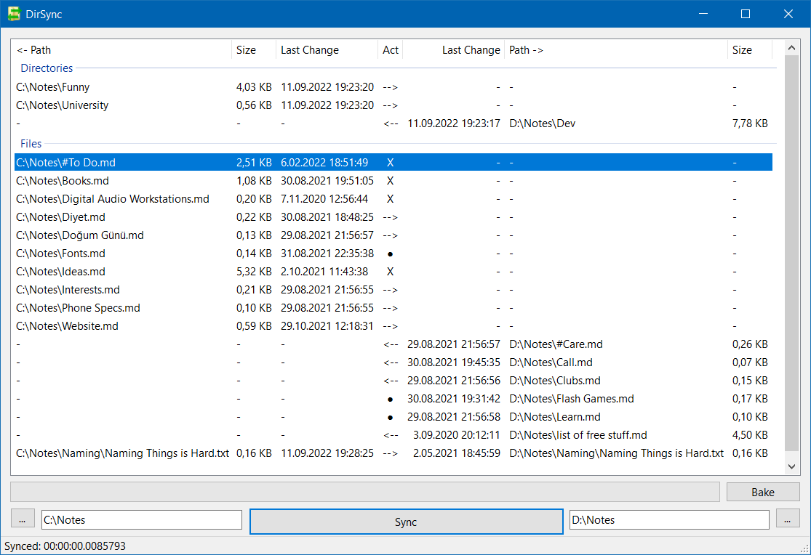

  
Dir Sync  
   
========
Graphical Directory Synchronization Tool

Dir Sync is a convenient graphical tool for directory synchronization. It can be useful when you're making changes in some folder and want to propagate these to its backup copy. Another scenario is when you're working on the same folder in two different computers and want to merge these changes.

Dir Sync is not a substitute for version control systems. It does not check or merge file contents. It is a fast & lightweight tool for finding differences of two folders with tons of files.

Downloads
---------
Pre-built binaries can be found inside [Releases](https://github.com/ahmetsait/Dir-Sync/releases) section.

Getting Started
---------------
1. Select which directories you want to check by clicking `...` or copy-paste your folder paths.
2. Click `Sync` and wait Dir Sync to traverse over the directory structures finding differences of the two.
3. You will see a list consisting of directories and files.
Dir Sync will show both files / folders inside explorer (file manager) if you double click an item on the list.
4. `Act` column indicates the suggested file / folder operation (action) for resolving the difference.
`-->` means copy to folder on the right, `<--` means copy to left, `X` means delete them both, and `●` means do nothing.
5. You can change the action by right clicking the items. It's also possible to change multiple actions at once by selecting more with either _Shift_ or _Ctrl_.
6. Click `Bake` to perform the selected actions.

Limitations
-----------
- Dir Sync does not check file contents. It can show you some false positives where the files are identical but have different time stamps.
- Dir Sync ignores 1 minute difference between last modification times because for some reason files don't always have identical time stamps after copying them on Windows.

License
-------
Dir Sync is licensed under the [MIT License](LICENSE).
